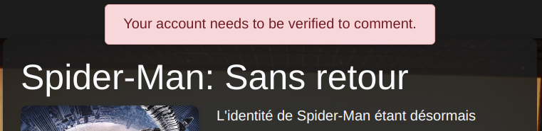
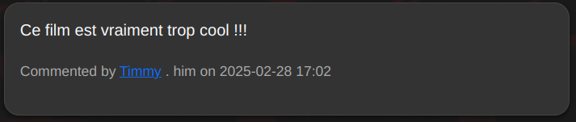
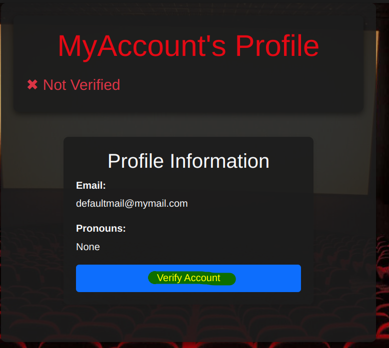
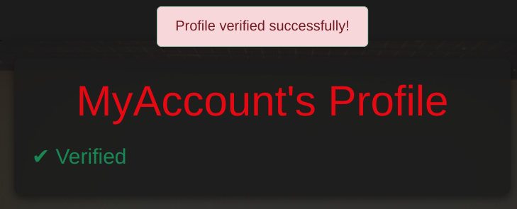

# Writeup - StrangeQuery

Ce write-up décrit l'exploitation de deux vulnérabilités présentes dans une application web "Netflute" : une élévation de privilèges via cookie et une injection SQL aveugle de second ordre (Blind SQLi Second order).

## Étape 1 - Élévation de Privilèges via Cookie (`is_a_cool_admin`)

La première étape consiste à obtenir la vérification d'un compte utilisateur en manipulant un cookie nommé `is_a_cool_admin`. Ce cookie contrôle l'accès à certaines fonctionnalités administratives, notamment la vérification des profils.

### Démonstration

À l'origine, le compte utilisateur créé n'est **pas vérifié**, ce qui empêche certaines actions comme publier un commentaire :

\


\
Si l'on tente de commenter un film, l'action est bloquée :

\


\
En parcourant la section des commentaires d’un film, il est possible de cliquer sur le pseudo des autres utilisateurs pour accéder à leur profil :

\


\
Cela redirige vers une URL de ce type : `http://localhost:5000/profile/2`. En effectuant un **brute-force** simple sur les IDs utilisateurs, on retrouve son propre profil et l'état de vérification associé :

\


\
On remarque qu'un **bouton de vérification** est présent, mais uniquement visible (ou fonctionnel) pour les administrateurs :

\


\
En inspectant les cookies du navigateur, on trouve le cookie `is_a_cool_admin`, défini par défaut à `"no"`. En le passant manuellement à `"yes"`, on obtient l'accès à la fonctionnalité de vérification du compte :

\


\
Le compte est désormais vérifié, ce qui débloque certaines fonctionnalités, comme la possibilité de commenter.


## Étape 2 - Injection SQL Aveugle de Second Ordre (Blind SQLi Second Order)

La deuxième vulnérabilité exploite une mauvaise gestion de l'attribut **pronoun** d'un utilisateur. Cet attribut est modifiable par l'utilisateur lui-même et peut être manipulé pour contenir une requête SQL malveillante.

L'injection n'est pas déclenchée immédiatement, elle s'exécute lorsque l'utilisateur est **mentionné (taggé)** dans un commentaire — d'où le terme **"injection SQL de second ordre"**.

### Démonstration

L'application permet de mentionner (tagger) d'autres utilisateurs dans les commentaires :

\


\
En injectant une charge utile SQL dans le champ **pronoun** d'un utilisateur, l'injection se déclenchera lorsqu'il sera mentionné dans un commentaire. Exemple de charge utile dans le champ pronoun :

```sql
'OR'1'='1
```
\
Nous pouvons maintenant utiliser un script pour voler tout le contenu de la base de données (voir solve.py). \
Ici je résoud le challenge en utilisant un service web flask qui sera utiliser par sqlmap via la commande suivante:

```
sqlmap -u "http://127.0.0.1:8080/?payload=a" \
--technique=B \
--string="Spider" \
--batch \
--risk=3 --level=5 \
-D public -T secrets --dump
```
